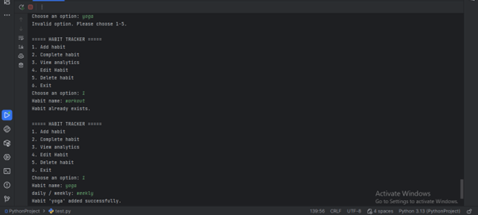
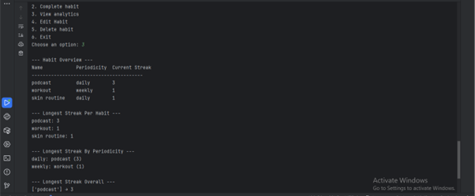
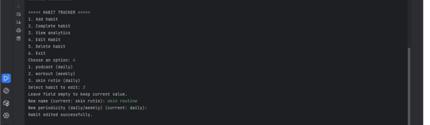
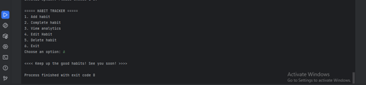

# Habit Tracker with Streak Analysis

A command-line Python application to track habits, record completions, and analyze streaks.

The application supports both **daily** and **weekly** habits and provides detailed analytics using a modular architecture and SQLite database persistence.

---

## Features

- Create, edit, and delete habits
- Support for **daily** and **weekly** periodicity
- Record completion dates per habit
- Calculate:
  - Longest streak per habit
  - Current active streak per habit
  - Longest streak across all habits
  - Longest streak per periodicity (daily / weekly)
- Persistent storage using SQLite
- Fully tested with `pytest`

---

## Project Structure
habit_tracker/
│
├── screenshots/
│   ├── Ad_habit.png
│   ├── Analytics_output.png
│   ├── Delete habit and clean numbering.png
│   ├── Edit_habit.png
│   ├── Exit.png
│   ├── pytest_results.png
│
├── main.py
├── database.py
├── analyze.py
├── habit.py
├── test_habit_tracker.py
├── README.md

---

## Installation

### 1. Clone the repository
git clone https://github.com/Zahra-Tohidi-eng/Habit-Tracker.git

cd habit-tracker

### 2. (Optional) Create a virtual environment
python -m venv venv

Activate it:

- **Linux / macOS**
source venv/bin/activate

- **Windows**
venv\Scripts\activate

### 3. Install dependencies
pip install -r requirements.txt

Currently, only `pytest` is required for running tests.

---

## Usage

Example usage in Python:

```python
from datetime import date
from habit import Habit
from database import save_habits, load_habits
from analyze import longest_streak_for_habit

# Create a habit

# Record completions
habit.complete(date(2026, 1, 1))
habit.complete(date(2026, 1, 2))

# Save to database
save_habits("habits.db", [habit])

# Load from database
habits = load_habits("habits.db")

# Analyze streak
print(longest_streak_for_habit(habits[0]))  # Output: 2
```
## Analytics Module

The analytics module provides:

- longest_streak_for_habit(habit)
- current_streak_for_habit(habit)
- longest_streak_all_habits(habits)
- longest_streak_by_periodicity(habits)

These functions operate independently from the database layer and work directly on Habit objects.

## Testing
The test suit is implemented using pytest and includes:
- Tests for habit creation, editing, and deletion
- Tests for 3 daily and 2 weekly habits
- Longest streak calculations
- Current streak calculations
- Aggregate analytics per periodicity
The project is fully testable and follows a modular architecture to ensure maintainability.

## Database

The application uses SQLite for persistence. Two tables are created:

- habits (id, name, periodicity, start_date)
- completions (habit_id, completion_date)

## Screenshots

### CLI Example


### Analytics Output


### Delete Habit and Clean Numbering

### Edit habit


### Exit


### Unit Tests Passing


## Development Environment

The project was developed using PyCharm and Python 3.

## License

MIT License © 2026 Zahra Tohidi